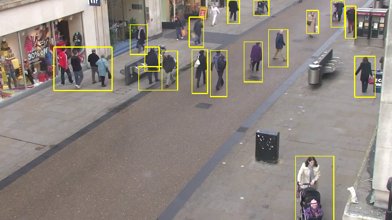
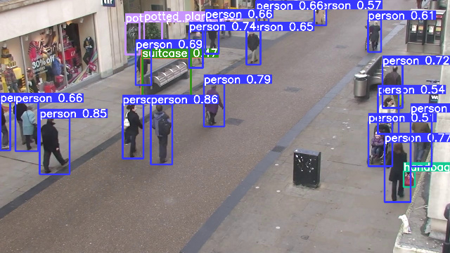

# KNN Background Substractor vs Yolov5 for Pedestrian Detection

## Overview

This project aims to compare the performance of a simple KNN (K-Nearest Neighbors) background subtractor implemented in OpenCV and the YOLOv5 model for pedestrian detection. The comparison includes a video demonstration of the inference process and provides examples of two frames with detections using both models. The predictor file contains the functions for both detectors, and the main file allows running the process using the Click library to choose a method and a video.

  
  
  <h6 align="center">
    Example of frames with Yolo and KNN detection
  </h6>

## Requirements

- Python 3.10 or later
- Click
- PyTorch
- Yolov5
- OpenCV